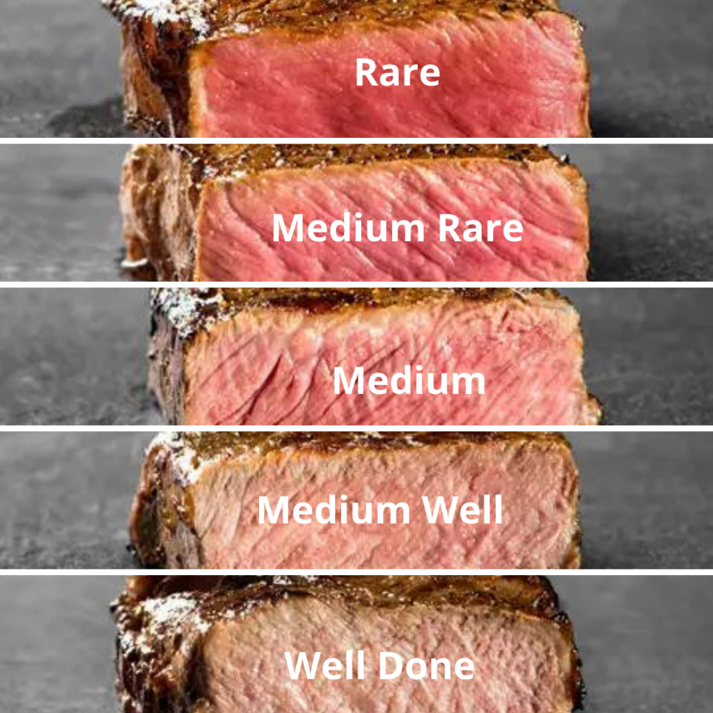

```
.___  ___.      ___   .___________. __    __  .______       ___      
|   \/   |     /   \  |           ||  |  |  | |   _  \     /   \     
|  \  /  |    /  ^  \ `---|  |----`|  |  |  | |  |_)  |   /  ^  \    
|  |\/|  |   /  /_\  \    |  |     |  |  |  | |      /   /  /_\  \   
|  |  |  |  /  _____  \   |  |     |  `--'  | |  |\  \-./  _____  \  
|__|  |__| /__/     \__\  |__|      \______/  | _| `.__/__/     \__\

```
My matura practise


## Rating system
> "one photo is worth a thousand words"


also progress bars below sometimes show the completion percentage and sometimes the score. It depends on my mood, and is nowhere near objective.


## Matury
### Informatyka
#### arkusz przykładowy 2023 - medium well
- [overview](informatyka/extras/arkusz_przykladowy-2023/)
- 

#### 06 2022 - medium
- [overview](informatyka/202206/)
- 

#### 05 2022 - medium
- [overview](informatyka/202205/)
- 

#### 06 2021 - well done
- [overview](informatyka/202106/)
- 

#### 05 2021 - medium
- [overview](informatyka/202105/)
- 

#### 03 2021 - well done
- [overview](informatyka/202103/)
- 

#### 07 2020 - well done
- [overview](informatyka/202007/)
- 

#### 06 2020 - well done
- [overview](informatyka/202006/)
- 

#### 04 2020 - well done
- [overview](informatyka/202004/)
- 

#### 06 2019 - well done
- [overview](informatyka/201906/)
- 

#### 05 2019 - well done
- [overview](informatyka/201905/)
- 

#### 05 2015 - rare
- [overview](informatyka/201505/)
- 


### Polski
#### arkusz pokazowy Operon (Arkusz 1) - well done
- [overview](polski/pokazowy-operon-1/)
- 

#### arkusz pokazowy Operon (Arkusz 2) - medium rare
- [overview](polski/pokazowy-operon-2/)
- 

#### arkusz pokazowy GWO (Arkusz 8) - medium
- [overview](polski/pokazowy-oke-9/)
- 

#### arkusz pokazowy GWO (Arkusz 9) - medium well
- [overview](polski/pokazowy-oke-9/)
- 

#### arkusz pokazowy GWO (Arkusz 10) - medium well
- [overview](polski/pokazowy-oke-10/)
- 


### Angielski
#### arkusz pokazowy CKE - well done
- [overview](angielski/pokazowy-cke/)
- 