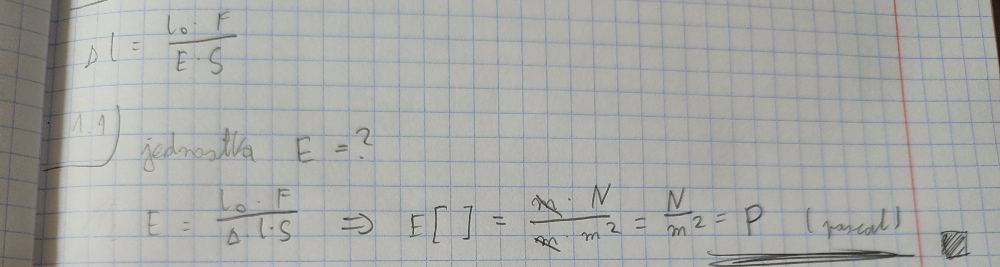
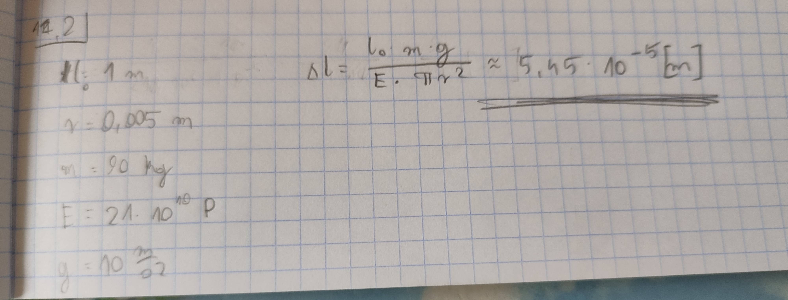
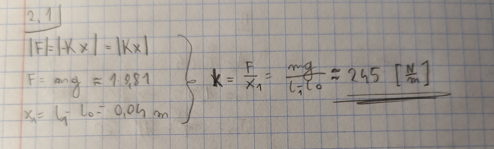
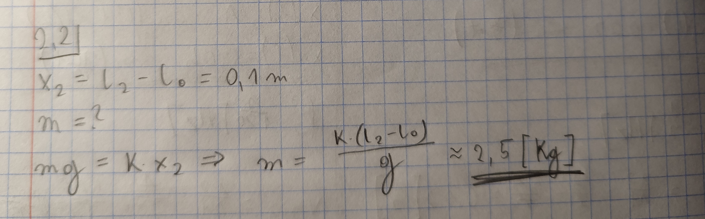

# zad 1
[matura rozszerzona - listopad 2015 - zad 8](https://arkusze.pl/matura-probna-operon-fizyka-2015-poziom-rozszerzony/)

## 1.1

## 1.2

# zad 2
[matura rozszerzona - styczen 2016 - zad 9](https://arkusze.pl/matura-probna-nowa-era-fizyka-2016-poziom-rozszerzony/)

## 2.1

## 2.2

## 2.3
potrzebne prawo Hooke'a

## zad 2.3
potrzebne 2.3

# zad 3
[matura rozszarzona - maj 2016 - zad 8](https://arkusze.pl/matura-fizyka-2016-maj-poziom-rozszerzony/)

## 3.1

## 3.2
C 1