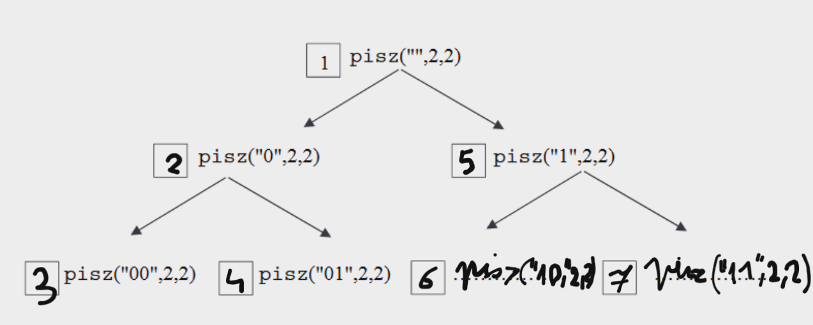

[matura arkusze.pl](https://arkusze.pl/matura-informatyka-2019-maj-poziom-rozszerzony/)

# zad 1
## 1.1
[kod](cz1/1/11.cpp)

jest liniowo, mogłoby być log z binary search

## 1.2
**liniowa**

# zad 2
## 2.1


## 2.2
wywołanie funkcji | wypisany tekst | liczba wywołań funkcji
------------------|----------------|-----------------------
pisz("", 3, 2) | 000, 001, 010, 011, 100, 101, 110, 111 | 15 (1+2+4+8)
pisz("", 2, 3) | 00, 01, 02, 10, 11, 12, 20, 21, 22 | 13 (1+3+9)

## 2.3
mamy ciąg:
$$
k^0, \underline{k^1, k^2 ... k^{n-1}, k^n} \\

a_1 = k \\
q = k \\
n = n \\

\downarrow \\
S_n=a_1\frac{1-q^n}{1-q} \\

\downarrow \\
S_n = k\frac{1-k^n}{1-k} + 1
$$

$+1$ jest tam, bo nie policzyliśmy $k_0 = 1$, więc po prostu je dodajemy

i to jest dobre, zrozumiałe, przyjemne rozumowanie, a to jest (również) akceptowana odpowiedź: $$1+k^1+k^2+...+k^{n-1}+k^n$$, dafaq?

# zad 3
## 3.1
1. F
2. P
3. P
4. F

## 3.2
1. P
2. F
3. P
4. P

## 3.3
1. P
2. P
3. F
3. F


# zad 4
## 4.1
[kod](cz2/4/41.cpp)
```
18

Process returned 0 (0x0)   execution time : 0.338 s
Press any key to continue.
```

## 4.2
[kod](cz2/4/42.cpp)
```
2
145
1
40585

Process returned 0 (0x0)   execution time : 0.378 s
Press any key to continue.
```

## 4.3
[kod](cz2/4/43.cpp)
```
31968 150 74

Process returned 0 (0x0)   execution time : 0.405 s
Press any key to continue.
```


# zad 5
[plik excel](cz2/5/chmury.xlsx)


# zad 6
[plik ms access](cz2/6/perfumeria.accdb)

## 6.2
ok, zapachy są takie:
```
aromatyczna
cytrusowa
cytrusowo-aromatyczna
drzewna
kwiatowa
kwiatowo-drzewna
kwiatowo-orientalna
kwiatowo-szyprowa
orientalna
orientalna lagodna
orientalno-drzewna
owocowa
pudrowa
skorzana
szyprowa
szyprowo-skorzana
wodna
zielona
```

więc robimy takie zapytanie:
```
SELECT TOP 1 Perfumy.rodzina_zapachow, Perfumy.cena AS najniższa_cena, Perfumy.nazwa_p
FROM Perfumy
WHERE Perfumy.rodzina_zapachow = "<tutaj wpisujemy kolejne rodziny>"
GROUP BY Perfumy.rodzina_zapachow, Perfumy.cena, Perfumy.nazwa_p
ORDER BY Perfumy.cena ASC;
```
i lecimy po kolei:
```
rodzina_zapachow	najniższa_cena	nazwa_p
aromatyczna	124	Ibrary Ollec D'amore
cytrusowa	259	Sian Grad
cytrusowo-aromatyczna	178	Re Nostrum,ir
drzewna	123	Pperlee Bouquet
kwiatowa	110	Ose Deurmaline
kwiatowo-drzewna	104	Rougna
kwiatowo-orientalna	103	Arla : Vivace
kwiatowo-szyprowa	287	Etish Pothal
orientalna	113	Anille La Tosca
orientalna lagodna	122	Ndy Warhol S Rose
orientalno-drzewna	138	LackNight
owocowa	154	Ake Perfucturne
pudrowa	139	Ivm Cristal
skorzana	112	Ui Mare
szyprowa	226	Usk ti 1888
szyprowo-skorzana	158	Uir OtPlace
wodna	146	Ilver Mounaya
zielona	406	EOman
```